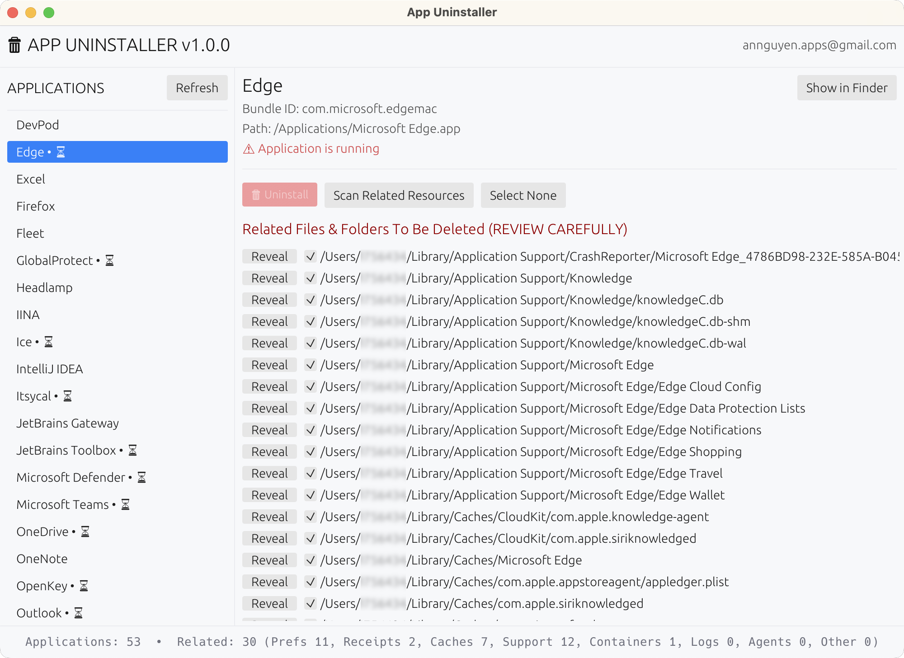

# 🗑 macOS App Uninstaller (Rust + egui)

A lightweight application for **macOS** that allows you to:

- List all applications installed in `/Applications` and `~/Applications`.
- Detect running applications (cannot be uninstalled).
- View and select related files/data for deletion (LaunchAgents, Logs, Preferences, Receipts, Containers...).
- Move applications and data to **Trash** instead of immediate deletion.
- Native macOS interface with `.icns` icon and AppKit theme.
- Display progress bar when performing background tasks.



---

## 📦 System Requirements

- **macOS 11.0 Big Sur** or later (macOS 12+ recommended).
- **Rust toolchain** (Edition 2024, latest Stable or Nightly).
- `cargo-bundle` to build `.app`:
  ```bash
  cargo install cargo-bundle
  ```
- **Xcode Command Line Tools** (for building on macOS):
  ```bash
  xcode-select --install
  ```
- **librsvg** (to convert SVG to ICNS):
  ```bash
  brew install librsvg
  ```

---

## 📁 Project Structure

```
mac_uninstaller/
 ├─ src/
 │   ├─ main.rs           # Entry point and eframe initialization
 │   ├─ core.rs           # Business logic (scan apps, find related files)
 │   ├─ osx.rs            # macOS utilities (set Dock icon, open System Settings)
 │   ├─ style.rs          # Theme and styling for egui
 │   ├─ types.rs          # Data structure definitions
 │   └─ ui/
 │       ├─ mod.rs        # Main UI state and eframe App implementation
 │       ├─ tasks.rs      # Background tasks (refresh, scan, uninstall)
 │       ├─ list.rs       # A custom list item component
 │       └─ panels/       # UI components (top, side, central, bottom)
 ├─ resources/
 │   ├─ icon.icns         # Main app icon
 │   ├─ icon_dark.icns    # Icon for dark mode
 │   ├─ icon.svg          # Vector source
 │   ├─ icon_dark.svg     # Vector source for dark mode
 │   └─ svg-to-icns.sh    # Script to convert SVG to ICNS
 ├─ Cargo.toml
 └─ README.md
```

---

## 🛠 Main Dependencies

- **eframe/egui 0.32**: GUI framework
- **sysinfo 0.37**: Check running processes
- **plist 1.7**: Read Info.plist of app bundles
- **trash 5.2**: Move files to Trash safely
- **walkdir 2.5**: Recursive directory scanning
- **cocoa/objc**: macOS native integration

---

## 🚀 Running the Application (Debug mode)

```bash
git clone https://github.com/antruongnguyen/mac-app-uninstaller.git
cd mac_uninstaller
cargo run
```

The application will open with a 1000x700px window and automatically scan apps on startup.

---

## 🖥 Building `.app` for macOS

1. **Use the included script** to convert SVG to ICNS:
   ```bash
   ./svg-to-icns.sh
   ```

2. **Build release**:
   ```bash
   cargo bundle --release
   ```

3. The `.app` file will be located at:
   ```
   target/release/bundle/osx/App Uninstaller.app
   ```

4. **Bundle metadata** is defined in `Cargo.toml`:
   - App name: "App Uninstaller"
   - Bundle identifier: "day.nhanh.appuninstaller"
   - Icon: `resources/icon.icns`

---

## 🎨 UI Features

- **Sidebar**: App list with running status indicators
- **Central panel**: Selected app details and related files list
- **Progress bar**: Shows scan/uninstall progress
- **Status log**: History of performed operations
- **macOS native styling**: Theme similar to System Preferences
- **Dock icon**: Automatically set from bundle resources

---

## 🛡 Access Permissions

The application requires the following permissions:

**Full Disk Access** to:
- Read app information in `/Applications`
- Delete files in system directories (`~/Library`, `/Library`)
- Scan receipts in `/private/var/db/receipts`

**App Management** to:
- Uninstall applications and their components
- Manage application bundles and associated files

**How to grant permissions:**
- Open **System Settings** → **Privacy & Security** → **Full Disk Access**
- Click the (+) button and add the `App Uninstaller.app` file
- Also go to **App Management** in the same Privacy & Security section
- Add the `App Uninstaller.app` file there as well

---

## 📂 Scanned File Locations

The application automatically finds related files in:

**User Library:**
- `~/Library/Application Support/<bundle_id|app_name>`
- `~/Library/Caches/<bundle_id|app_name>`
- `~/Library/Preferences/<bundle_id>.plist`
- `~/Library/Containers/<bundle_id>`
- `~/Library/Logs/<app_name>`
- `~/Library/LaunchAgents/<bundle_id|app_name>*`

**System Library:**
- `/Library/Application Support/<bundle_id>`
- `/Library/Preferences/<bundle_id>.plist`
- `/Library/Receipts/<app_name>*`
- `/private/var/db/receipts/<bundle_id|app_name>*`

---

## 💡 Notes

- **Safety**: The application only moves files to Trash, never permanently deletes them
- **Smart detection**: Detects running apps based on process name and bundle ID
- **Selective uninstall**: Allows selecting individual files/folders
- **Background tasks**: UI remains responsive during scan/uninstall operations
- **Error handling**: Graceful fallback if moving to Trash fails

---

## 👨‍💻 Author

**An Nguyen**  
📧 annguyen.apps@gmail.com  
🌐 https://nhanh.day

---

## 📜 License

MIT License — You are free to modify and distribute.
